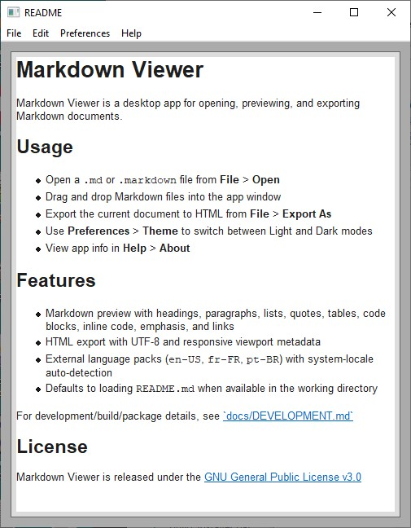
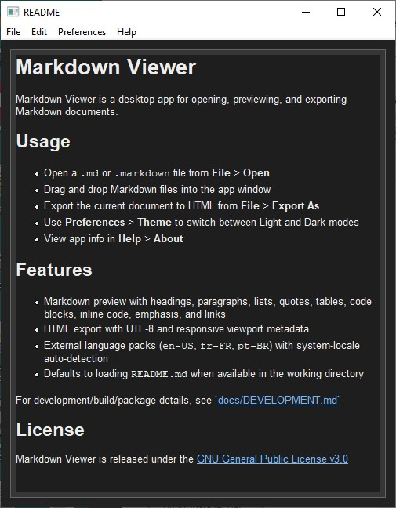

# Markdown Viewer

Markdown Viewer is a modern, cross-platform desktop application for opening, previewing, and exporting Markdown documents.

| Light Theme | Dark Theme |
| :--- | :--- |
|  |  |

## Features

- **Full Markdown support**: Headings, blockquotes, tables, lists, task lists, and horizontal rules.
- **Advanced formatting**: Table of Contents (`[TOC]`), footnotes (`[^1]`), reference links, and strikethrough.
- **Modern UI**: Light and Dark theme support with automatic system-theme detection.
- **Internationalization**: Support for `en-US`, `fr-FR`, and `pt-BR`.
- **Cross-Compiler Support**: Builds with MSVC, Clang, and GCC on Windows; Clang/GCC on Linux and macOS.

## Quick Start (Windows)

Direct download (Windows installer): [markdown-viewer-1.0.0-win64.exe](https://github.com/promptengineer1768/markdown-viewer/releases/download/v1.0.0/markdown-viewer-1.0.0-win64.exe)

1. Ensure you have [CMake](https://cmake.org/), [Ninja](https://ninja-build.org/), and [vcpkg](https://vcpkg.io/) installed.
2. Run `build-msvc-debug.bat` to build and test using MSVC 2022.
3. Launch the app from `build/windows-msvc-debug/bin/markdown_viewer.exe`.

## Build & Development

For detailed build instructions and architecture overview, see [docs/DEVELOPMENT.md](docs/DEVELOPMENT.md).
For library usage guidance, see [docs/API.md](docs/API.md).

## License

Markdown Viewer is released under the [GNU General Public License v3.0](LICENSE).
